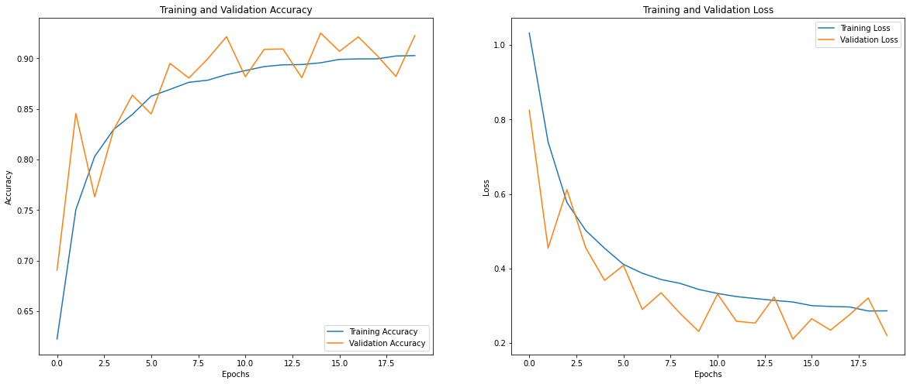
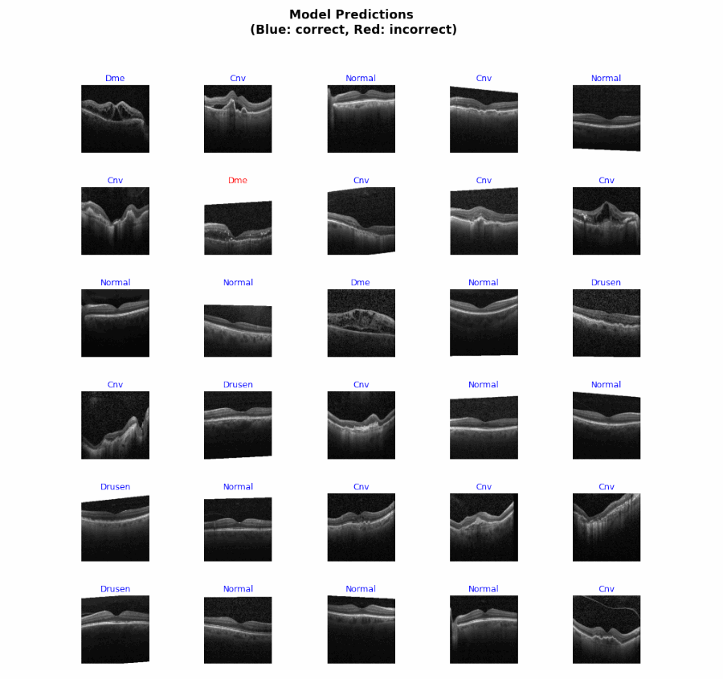

# retinal-oct-classification

  

## Description

Retinal-oct-classification is a jupyter notebook that utilizes CNN (Convolutional Neural Network) to accurately classify macular degeneration and diabetic retinopathy (four classes in total) using patient retinal OCT (Optical Coherence Tomography) images. By creating a CNN model and training it with over **66,885 medical images**, I was able to build a model that achieved **92.57% accuracy rate**. To process large sets of high quality images efficiently, I decided to use Google Colab, which allowed me to utilize its GPUs and memory space. The dataset used for this notebook was acquired from [Kaggle](https://www.kaggle.com/paultimothymooney/kermany2018).

The general process for the notebook was:

1. Import all necessary packages
2. Attain dataset from Kaggle
3. Data preprocessing
4. Data augmentation and preparation
5. Creating a CNN model
6. Compiling the CNN model
7. Training the CNN model
8. Visualization of Model Performance
9. Model Prediction
10. Visualizations for Class Activation Map

## Usage

Every detailed step was recorded in the notebook and can easily be followed there. However, one will need to have his or her own Kaggle API key to be able to download the dataset from Kaggle. To create a Kaggle API Token, create/log in to Kaggle, go to "Accounts" and to "API", and finally attain the required JSON file.

## Figures and Charts

Model Performance (Accuracy and Loss)

Model Prediction and Grad-CAM Visualizations

